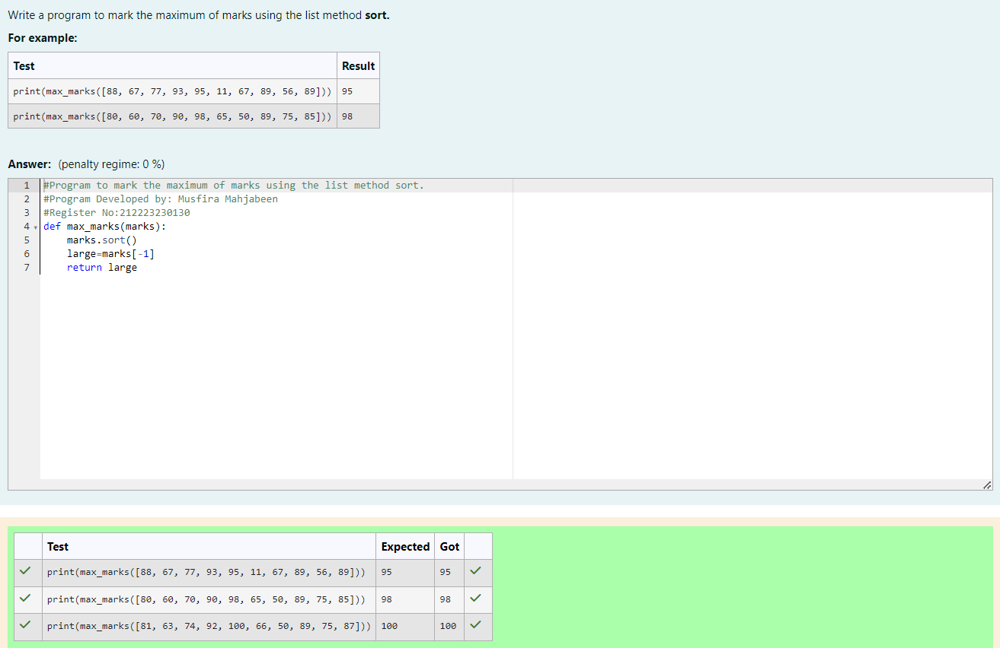
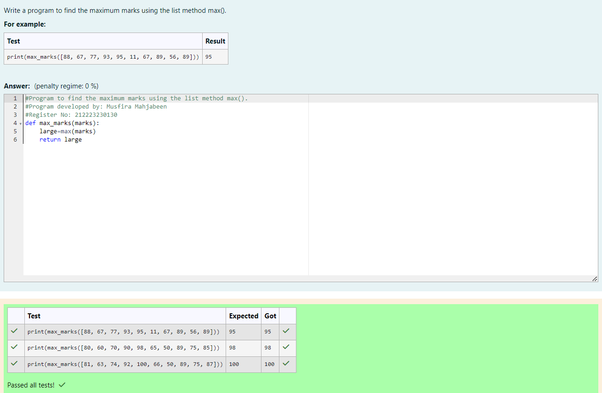

# Find the maximum of a list of numbers

## Aim:

To write a program to find the maximum of a list of numbers.

## Equipment’s required:

1. Hardware – PCs
2. Anaconda – Python 3.7 Installation / Moodle-Code Runner

## Algorithm:

1. Get the list of marks as input
2. Use the sort() function or max() function or use the for loop to find the maximum mark.
3. Return the maximum value

## Program:

i) # To find the maximum of marks using the list method sort.

```Python
# Program to mark the maximum of marks using the list method sort.
# Developed by: Musfira Mahjabeen
# Register No:212223230130
def max_marks(marks):
    marks.sort()
    large=marks[-1]
    return large


```

ii) # To find the maximum marks using the list method max().

```Python
# Program to find the maximum marks using the list method max().
# Developed by: Musfira Mahjabeen
# Register No: 212223230130
def max_marks(marks):
    large=max(marks)
    return large


```

iii) # To find the maximum marks without using builtin functions.

```Python
# Program to find the maximum marks without using builtin functions.
# Developed by: Musfira Mahjabeen
# Register No: 212223230130
def max_marks(marks):
    max_mark=0
    for i in marks:
        if i>max_mark:
            max_mark=i
    return max_mark


```

## Output:

i) # To find the maximum of marks using the list method sort.


ii) # To find the maximum marks using the list method max().


iii) # To find the maximum marks without using builtin functions.


## Result:

Thus the program to find the maximum of given numbers from the list is written and verified using python programming.
